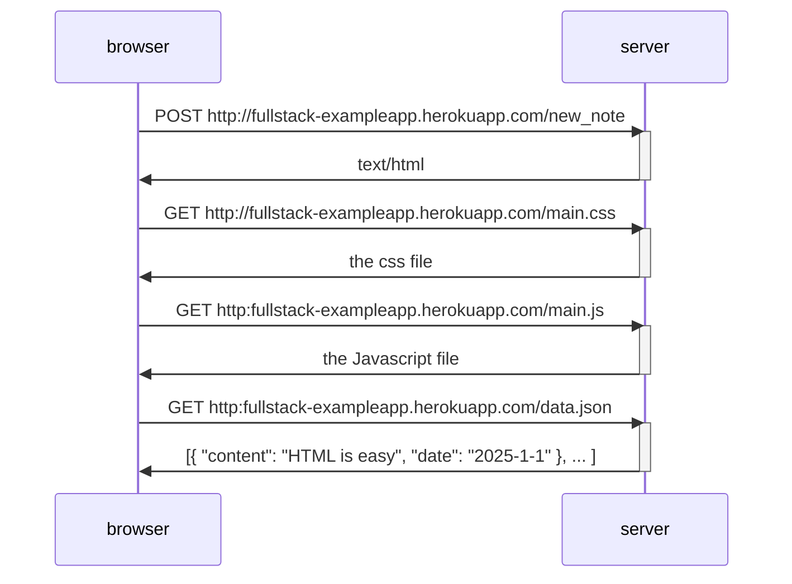

# Fullstack-part0.4 New note diagram

```mermaid
sequenceDiagram
    participant browser
    participant server

    browser->>server: POST http://fullstack-exampleapp.herokuapp.com/new_note
    activate server
    server->>browser: text/html
    deactivate server

    browser->>server: GET http://fullstack-exampleapp.herokuapp.com/main.css
    activate server
    server->>browser: the css file
    deactivate server

    browser->>server: GET http:fullstack-exampleapp.herokuapp.com/main.js
    activate server
    server->>browser: the Javascript file
    deactivate server

    browser->>server: GET http:fullstack-exampleapp.herokuapp.com/data.json
    activate server
    server->>browser: [{ "content": "HTML is easy", "date": "2025-1-1" }, ... ]
    deactivate server
```
