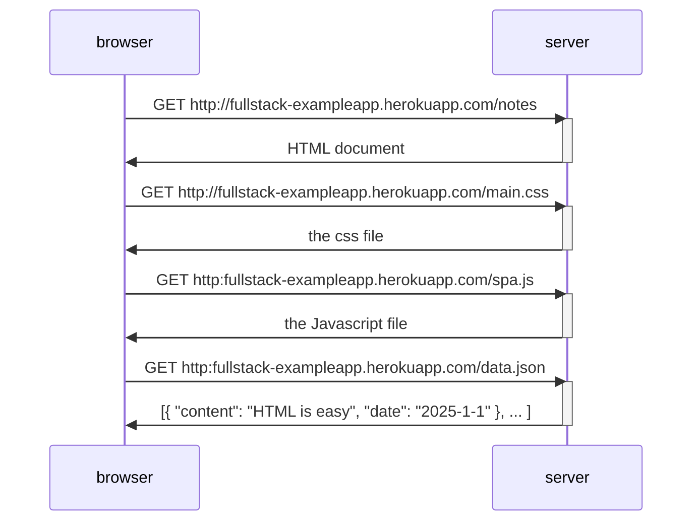

# Fullstack-part0.5 SPA diagram

```mermaid
sequenceDiagram
    participant browser
    participant server

    browser->>server: GET http://fullstack-exampleapp.herokuapp.com/notes
    activate server
    server->>browser: HTML document
    deactivate server

    browser->>server: GET http://fullstack-exampleapp.herokuapp.com/main.css
    activate server
    server->>browser: the css file
    deactivate server

    browser->>server: GET http:fullstack-exampleapp.herokuapp.com/spa.js
    activate server
    server->>browser: the Javascript file
    deactivate server

    browser->>server: GET http:fullstack-exampleapp.herokuapp.com/data.json
    activate server
    server->>browser: [{ "content": "HTML is easy", "date": "2025-1-1" }, ... ]
    deactivate server
```
